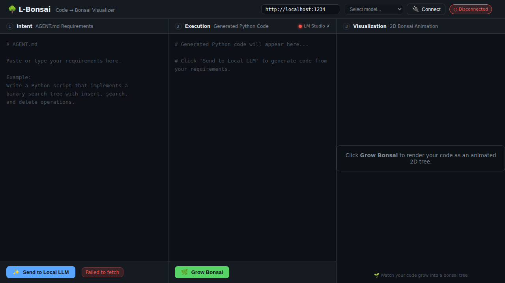
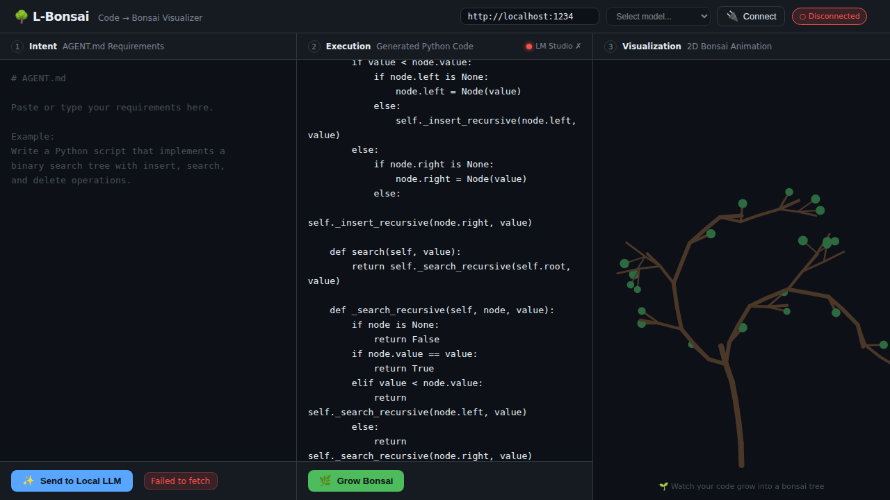
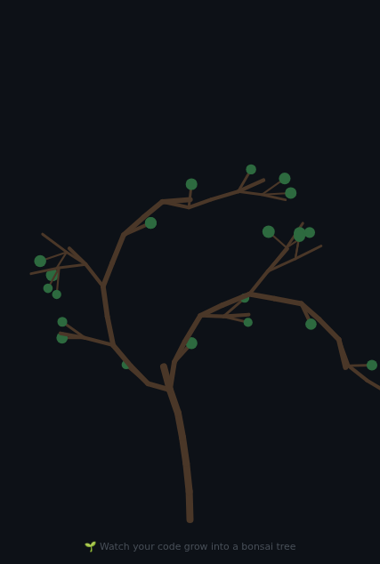

# L-Bonsai — Code-to-Bonsai Visualizer

Transform Python source code into an organic bonsai tree by mapping
Abstract Syntax Tree (AST) nodes to L-system turtle commands, rendered
with animated 2D canvas visualization in the browser.

## Screenshots

### Main Interface


The three-pane layout: Intent (requirements), Execution (Python code), and Visualization (bonsai tree).

### Code to Bonsai


Python code automatically transformed into an animated bonsai tree visualization.

### Bonsai Tree Detail


Each branch and leaf represents different Python AST nodes—functions, classes, loops, and more.

## Architecture

```
frontend/   — Vite + Canvas 2D UI (three-pane layout)
backend/    — FastAPI server (AST → L-system)
```

## Quick Start

### 1. Start the Python backend (in a virtual environment)

```bash
python -m venv .venv
source .venv/bin/activate  # Windows: .venv\Scripts\activate
cd backend
python -m pip install --upgrade pip
python -m pip install -r requirements.txt
uvicorn main:app --reload --port 8000
```

**Troubleshooting:**
- The backend uses recent versions of `pydantic` and `pydantic-core` with pre-built wheels for most platforms
- **If you see "failed to run custom build command for `pyo3-ffi`" errors:**
  1. Ensure you're using **Python 3.11+** (check with `python --version`)
  2. Upgrade pip first: `python -m pip install --upgrade pip` (should be pip 24.0+)
  3. Ensure binary wheels are allowed (no `PIP_NO_BINARY=:all:` environment variable)
  4. On macOS with Apple Silicon, ensure you're using native ARM Python, not x86_64 via Rosetta

### 2. Start the Vite frontend

```bash
cd frontend
npm install
npm run dev
```

Open [http://localhost:5173](http://localhost:5173) in your browser.

### 3. (Optional) LM Studio

For the "Send to Local LLM" feature, download and run
[LM Studio](https://lmstudio.ai/), load a model, and start the local
server at `http://localhost:1234`.

#### Using the Model Connection UI

The application includes UI controls in the header to manage your LM Studio connection:

1. **LM Studio URL Input**: Configure the base URL (default: `http://localhost:1234`)
   - The URL is persisted in localStorage for future sessions

2. **Model Selector**: Choose from available models loaded in LM Studio
   - Automatically populated when connected
   - Your selection is saved for the next session

3. **Connect Button**: Manually trigger connection to LM Studio
   - Shows connection status (🔌 Connect, ⏳ Connecting..., ✓ Connected)
   - Auto-refreshes available models on successful connection

The app automatically polls LM Studio every 5 seconds to maintain connection status.

## Usage Flow

| Pane | Name | Action |
|------|------|--------|
| 1 | **Intent** | Paste `AGENT.md` requirements → click *Send to Local LLM* |
| 2 | **Execution** | Review/edit streamed Python code → click *Grow Bonsai* |
| 3 | **Visualization** | Watch the animated 2D bonsai tree grow |

## AST → L-system Mapping

| Python construct | L-system command |
|-----------------|-----------------|
| `def` / `async def` | `F+[…]F` — upward branch |
| `class` | `FF-[…]+[…]F` — forked branch |
| `for` / `async for` | `F[…]F[…]F[…]F` — repeating loop |
| `while` | `F[…]F[…]F` — compact loop |
| `if` | `F-[…]+[…]F` — conditional fork |
| `with` | `F[…]F` — context branch |
| `try/except` | `F[…]+[…]F` — error branch |
| `import` | `FL` — twig with leaf |
| `=` / `:=` / `+=` | `FL` — assignment leaf |
| `return` / `yield` | `FLL` — tip with double leaf |
| Other statements | `F` — forward step |

## Tech Stack

- **Backend:** Python 3.11+, FastAPI, uvicorn
- **Frontend:** Vite, Canvas 2D API, ES6 modules
- **LLM:** LM Studio (OpenAI-compatible local API)
